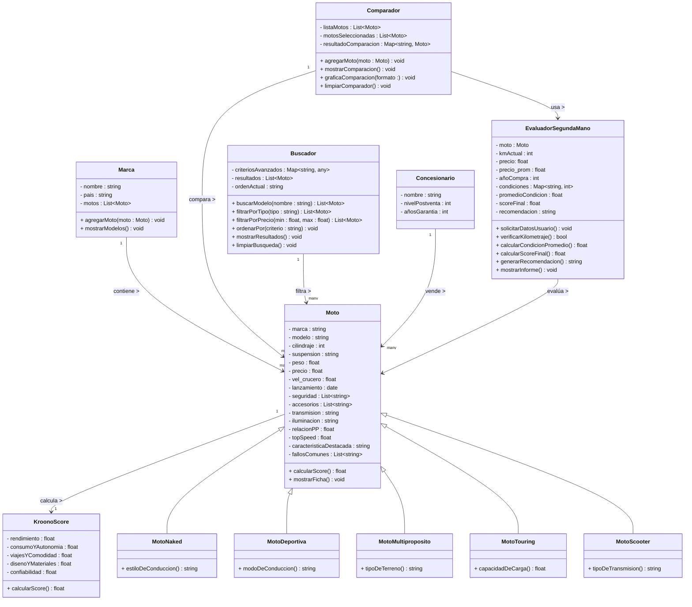

# proj_Lookvike
** Hecho a las carreras, organizado por el compa GPT

```mermaid
classDiagram
    %% ===== Clases principales =====
    class Marca {
        - nombre : string
        - pais : string
        - motos : List~Moto~
        + agregarMoto(moto : Moto) void
        + mostrarModelos() void
    }

    class Moto {
        - marca : string
        - modelo : string
        - cilindraje : int
        - suspension : string
        - peso : float
        - precio : float
        - vel_crucero : float
        - lanzamiento : date
        - seguridad : List~string~
        - accesorios : List~string~
        - transmision : string
        - iluminacion : string
        - relacionPP : float
        - topSpeed : float
        - caracteristicaDestacada : string
        - fallosComunes : List~string~
        + calcularScore() float
        + mostrarFicha() void
    }

    class KroonoScore {
        - rendimiento : float
        - consumoYAutonomia : float
        - viajesYComodidad : float
        - disenoYMateriales : float
        - confiabilidad : float
        + calcularScore() float
    }

    class Concesionario {
        - nombre : string
        - nivelPostventa : int
        - añosGarantia : int
    }

    class Comparador {
    - listaMotos : List~Moto~
    - motosSeleccionadas : List~Moto~
    - resultadoComparacion : Map~string, Moto~
    + agregarMoto(moto : Moto) void
    + mostrarComparacion() void
    + graficaComparacion(formato : ) void
    + limpiarComparador() void
}


    class Buscador {
    - criteriosAvanzados : Map~string, any~
    - resultados : List~Moto~
    - ordenActual : string
    + buscarModelo(nombre : string) List~Moto~
    + filtrarPorTipo(tipo : string) List~Moto~
    + filtrarPorPrecio(min : float, max : float) List~Moto~
    + ordenarPor(criterio : string) void
    + mostrarResultados() void
    + limpiarBusqueda() void
}


    class EvaluadorSegundaMano {
        - moto : Moto
        - kmActual : int
        - precio: float
        - precio_prom : float
        - añoCompra : int
        - condiciones : Map~string, int~
        - promedioCondicion : float
        - scoreFinal : float
        - recomendacion : string
        + solicitarDatosUsuario() void
        + verificarKilometraje() bool
        + calcularCondicionPromedio() float
        + calcularScoreFinal() float
        + generarRecomendacion() string
        + mostrarInforme() void
    }

    
    
    %% ===== Subclases de Moto =====
    class MotoNaked {
        + estiloDeConduccion() string
    }

    class MotoDeportiva {
        + modoDeConduccion() string
    }

    class MotoMultiproposito {
        + tipoDeTerreno() string
    }

    class MotoTouring {
        + capacidadDeCarga() float
    }

    class MotoScooter {
        + tipoDeTransmision() string
    }

    %% ===== Relaciones =====
    Marca "1" --> "many" Moto : contiene >
    Moto "1" --> "1" KroonoScore : calcula >
    Comparador "1" --> "many" Moto : compara >
    Buscador "1" --> "many" Moto : filtra >
    Concesionario "1" --> "many" Moto : vende >
    EvaluadorSegundaMano --> Moto : evalúa >
    Comparador --> EvaluadorSegundaMano : usa >


    %% ===== Herencias =====
    Moto <|-- MotoNaked
    Moto <|-- MotoDeportiva
    Moto <|-- MotoMultiproposito
    Moto <|-- MotoTouring
    Moto <|-- MotoScooter

``` 
