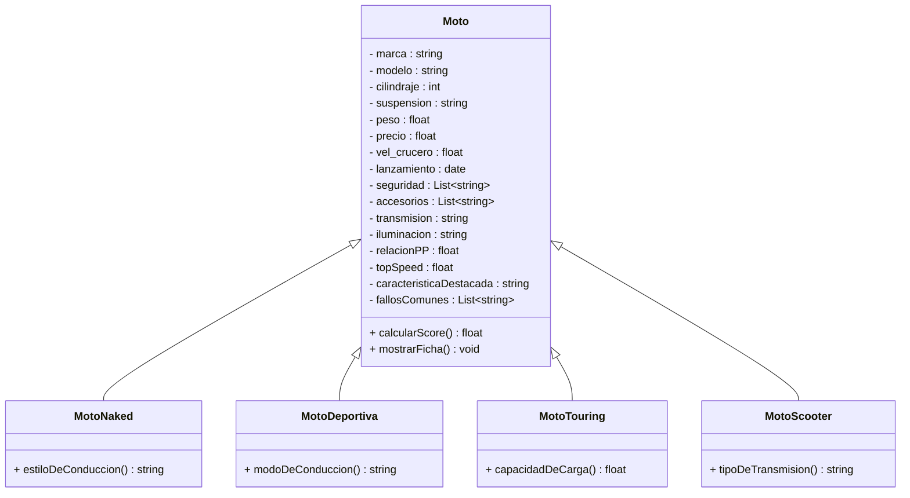
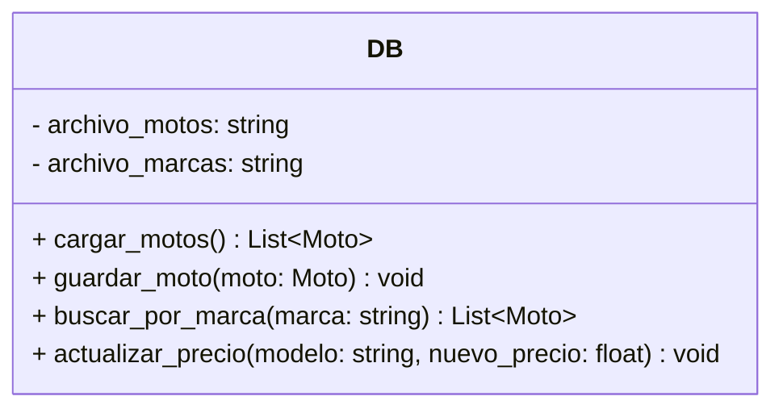
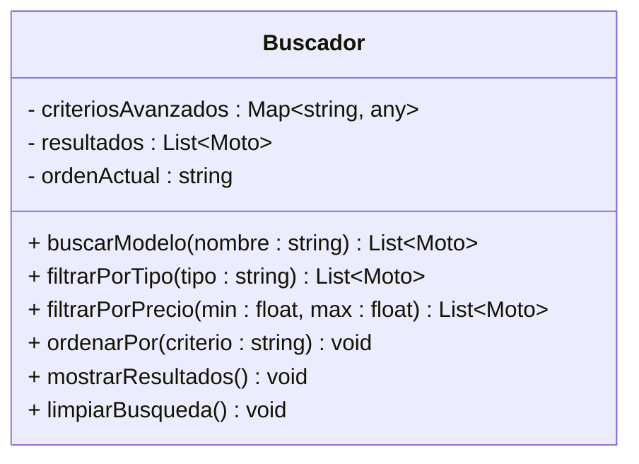
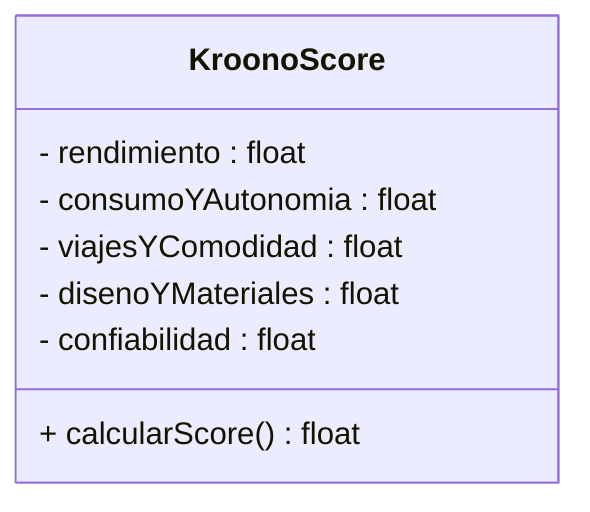
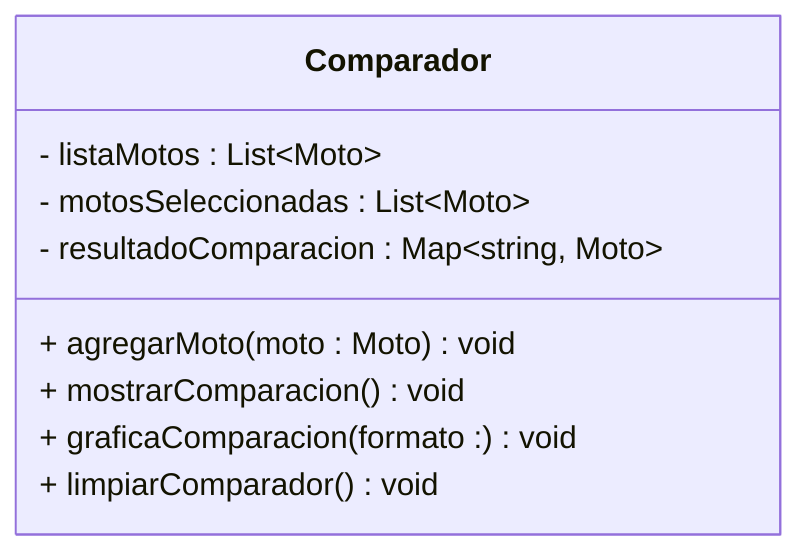

# proj_LVK
Comparador y Análisis de Motocicletas en Python.
[Logo]

Look_Vike es una proyecto especializado en análisis y evaluación comparativa de motocicletas, diseñada para ayudar a compradores a tomar decisiones informadas basadas en datos técnicos y criterios objetivos.

Este programa implementa las bases de la POO, tratando que cada sección integre clases, metodos y objetos, junto con las herramientas que hacen parte de esta forma de programación.

Este repositorio muestra una versión preliminar del proyecto.
#### Integrantes
  - Lucas García
  - Kevin Castellanos
  - Vladimir Camargo
## Objetivos
### General
- Simplificar el proceso de selección de motocicletas mediante herramientas de comparación y análisis que permitan al usuario identificar la mejor opción según sus necesidades específicas, presupuesto y preferencias de manejo.
### Especificos
- Implementar una arquitectura POO sólida con clases especializadas para diferentes tipos de motocicletas
- Desarrollar algoritmos de evaluación que calculen scores basados en múltiples criterios técnicos.
- Construir una base de datos estructurada de motocicletas con especificaciones técnicas completas
- Simplificar información técnica compleja para hacerla accesible a usuarios no expertos.
- Proporcionar recomendaciones personalizadas basadas en necesidades específicas del usuario.
- Implementar Webscrapping, contando asi información actualizada de cada motocicleta y Fabricante.

## Motivo
Este proyecto surge para solucionar un problema que algunos vivimos: buscar moto y mas sin tener experienca puede ser un caos. En un país con un mercado tan grande de dos ruedas, actualmente uno se puede perder en mil páginas o confiar en opiniones de redes sociales, por tanto, se necesita una herramienta que haga mas práctica esta tarea.
Con las herramientas aprendidas en el curso POO, identificamos que es posible crear algo cercano a dicha herramienta, ya que se pueden adaptar muchos conceptos del motociclismo a las bases del POO: Clases y Objetos.

## Funcionamiento
### Clase Principal: Moto

### Base de Datos

### Análisis de Motos

### KronoScore

## Comparativa

